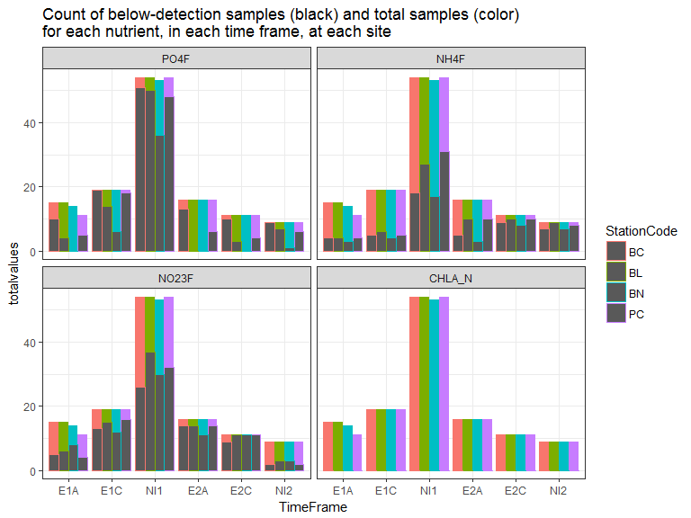
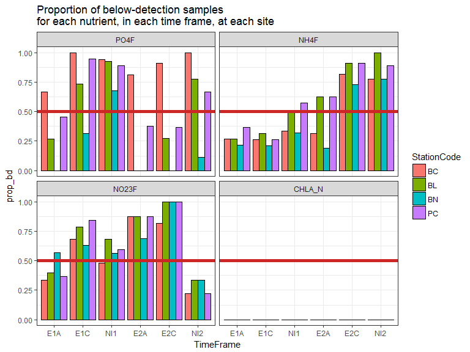
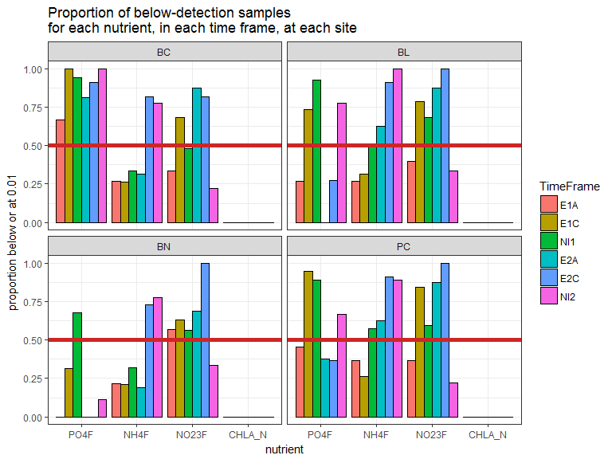

# Nutrients below detection
Kim Cressman  
`r Sys.Date()`  

```r
library(tidyverse)
library(lubridate)

setwd("C:/Users/kimberly.cressman/Desktop/Main Docs/Phosphate Publication/gndphosphate/Kim")
load("../data/nut_dat.RData")
```

### Data processing code chunk  
Expand this if you want to check either my reshaping of the dataset (I loaded `nut_dat.RData` from the gndphosphate GitHub repo) or my math going from mg/L to micromolar. The math I used was: 

+  PuM = Pmg/L * 1000 / 30.97  
+  NuM = Nmg/L * 1000 / 14  
+  DIN: NO23 + NH4, after converting both forms of N to micromolar


```r
# make it wide; add in columns for molarity (MICROMOLAR is the unit) and ratios
nut_wide <- nut_dat %>%
    select(StationCode, TimeFrame, date, nutrient, value) %>%
    spread(key=nutrient, value=value) %>%
    mutate(PO4M = PO4F * 1000/30.97, 
           NO23M = NO23F * 1000/14, 
           NH4M = NH4F * 1000/14,
           DINM = NH4M + NO23M,
           NtoP = DINM/PO4M,
           NH4toP = NH4M/PO4M)
```


The nutrient values have already been floored at 0.01, the highest MDL. Exactly how many 0.01s are there for each nutrient, at each site, in each time period?  

Note that some 0.01s could be actual above-detection 0.01 values, and I'm ignoring that fact here. It's fairly minor compared to the amount of data (admittedly, this is an assumption that should probably be chedked down the line).  

Actually, that long data format should work better for answering this question.


```r
nut_bd <- nut_dat %>%
    group_by(StationCode, nutrient, TimeFrame) %>%
    summarize(bdvalues = sum(value == 0.01, na.rm=TRUE), 
              totalvalues = length(value)) %>%
    mutate(prop_bd = round(bdvalues/totalvalues, 3))
```

What I want to do now is make either one nice pretty table, or separate tables for each nutrient; where rows are the site and columns are the time period, and values are the proporation of below detection. I don't know off the top of my head how to do it, and it will have to wait until after some lab work.  

`split` is easy, and then it should just be a `spread` command.... i think.  


```r
nut_bdwide <- nut_bd %>%
    gather(key=var, value=value, -StationCode, -nutrient, -TimeFrame) %>%
    mutate(newvar = paste0(TimeFrame, "_", var)) %>%
    select(-TimeFrame, -var) %>%
    spread(key=newvar, value=value)
```


Forget tables; I can make graphs!


```r
ggplot(nut_bd) +
    geom_col(aes(x=TimeFrame, y=totalvalues, fill=StationCode), position = "dodge") +
    geom_col(aes(x=TimeFrame, y=bdvalues, col=StationCode), position="dodge") +
    facet_wrap(~nutrient) +
    theme_bw() +
    ggtitle("Count of below-detection samples (black) and total samples (color) \nfor each nutrient, in each time frame, at each site")
```

<!-- -->

```r
ggplot(nut_bd) +
    geom_col(aes(x=TimeFrame, y=prop_bd, fill=StationCode), col="black", position = "dodge") +
    geom_hline(yintercept = 0.5, col="firebrick3", lwd=2) +
    facet_wrap(~nutrient) +
    theme_bw() +
    ggtitle("Proportion of below-detection samples \nfor each nutrient, in each time frame, at each site")
```

<!-- -->

Out of curiosity, facet by site instead of nutrient, and arrange the bars a little differently (group by nutrient and color by time period).


```r
ggplot(nut_bd) +
    geom_col(aes(x=nutrient, y=prop_bd, fill=TimeFrame), col="black", position = "dodge") +
    geom_hline(yintercept = 0.5, col="firebrick3", lwd=2) +
    facet_wrap(~StationCode) +
    theme_bw() +
    ggtitle("Proportion of below-detection samples \nfor each nutrient, in each time frame, at each site") +
    ylab("proportion below or at 0.01")
```

<!-- -->


Trying to use knitr functions to print the whole darn data frame. This isn't pretty, but it's all there.


```r
library(knitr)
kable(nut_bd, format="html")
```

<table>
 <thead>
  <tr>
   <th style="text-align:left;"> StationCode </th>
   <th style="text-align:left;"> nutrient </th>
   <th style="text-align:left;"> TimeFrame </th>
   <th style="text-align:right;"> bdvalues </th>
   <th style="text-align:right;"> totalvalues </th>
   <th style="text-align:right;"> prop_bd </th>
  </tr>
 </thead>
<tbody>
  <tr>
   <td style="text-align:left;"> BC </td>
   <td style="text-align:left;"> PO4F </td>
   <td style="text-align:left;"> E1A </td>
   <td style="text-align:right;"> 10 </td>
   <td style="text-align:right;"> 15 </td>
   <td style="text-align:right;"> 0.667 </td>
  </tr>
  <tr>
   <td style="text-align:left;"> BC </td>
   <td style="text-align:left;"> PO4F </td>
   <td style="text-align:left;"> E1C </td>
   <td style="text-align:right;"> 19 </td>
   <td style="text-align:right;"> 19 </td>
   <td style="text-align:right;"> 1.000 </td>
  </tr>
  <tr>
   <td style="text-align:left;"> BC </td>
   <td style="text-align:left;"> PO4F </td>
   <td style="text-align:left;"> NI1 </td>
   <td style="text-align:right;"> 51 </td>
   <td style="text-align:right;"> 54 </td>
   <td style="text-align:right;"> 0.944 </td>
  </tr>
  <tr>
   <td style="text-align:left;"> BC </td>
   <td style="text-align:left;"> PO4F </td>
   <td style="text-align:left;"> E2A </td>
   <td style="text-align:right;"> 13 </td>
   <td style="text-align:right;"> 16 </td>
   <td style="text-align:right;"> 0.812 </td>
  </tr>
  <tr>
   <td style="text-align:left;"> BC </td>
   <td style="text-align:left;"> PO4F </td>
   <td style="text-align:left;"> E2C </td>
   <td style="text-align:right;"> 10 </td>
   <td style="text-align:right;"> 11 </td>
   <td style="text-align:right;"> 0.909 </td>
  </tr>
  <tr>
   <td style="text-align:left;"> BC </td>
   <td style="text-align:left;"> PO4F </td>
   <td style="text-align:left;"> NI2 </td>
   <td style="text-align:right;"> 9 </td>
   <td style="text-align:right;"> 9 </td>
   <td style="text-align:right;"> 1.000 </td>
  </tr>
  <tr>
   <td style="text-align:left;"> BC </td>
   <td style="text-align:left;"> NH4F </td>
   <td style="text-align:left;"> E1A </td>
   <td style="text-align:right;"> 4 </td>
   <td style="text-align:right;"> 15 </td>
   <td style="text-align:right;"> 0.267 </td>
  </tr>
  <tr>
   <td style="text-align:left;"> BC </td>
   <td style="text-align:left;"> NH4F </td>
   <td style="text-align:left;"> E1C </td>
   <td style="text-align:right;"> 5 </td>
   <td style="text-align:right;"> 19 </td>
   <td style="text-align:right;"> 0.263 </td>
  </tr>
  <tr>
   <td style="text-align:left;"> BC </td>
   <td style="text-align:left;"> NH4F </td>
   <td style="text-align:left;"> NI1 </td>
   <td style="text-align:right;"> 18 </td>
   <td style="text-align:right;"> 54 </td>
   <td style="text-align:right;"> 0.333 </td>
  </tr>
  <tr>
   <td style="text-align:left;"> BC </td>
   <td style="text-align:left;"> NH4F </td>
   <td style="text-align:left;"> E2A </td>
   <td style="text-align:right;"> 5 </td>
   <td style="text-align:right;"> 16 </td>
   <td style="text-align:right;"> 0.312 </td>
  </tr>
  <tr>
   <td style="text-align:left;"> BC </td>
   <td style="text-align:left;"> NH4F </td>
   <td style="text-align:left;"> E2C </td>
   <td style="text-align:right;"> 9 </td>
   <td style="text-align:right;"> 11 </td>
   <td style="text-align:right;"> 0.818 </td>
  </tr>
  <tr>
   <td style="text-align:left;"> BC </td>
   <td style="text-align:left;"> NH4F </td>
   <td style="text-align:left;"> NI2 </td>
   <td style="text-align:right;"> 7 </td>
   <td style="text-align:right;"> 9 </td>
   <td style="text-align:right;"> 0.778 </td>
  </tr>
  <tr>
   <td style="text-align:left;"> BC </td>
   <td style="text-align:left;"> NO23F </td>
   <td style="text-align:left;"> E1A </td>
   <td style="text-align:right;"> 5 </td>
   <td style="text-align:right;"> 15 </td>
   <td style="text-align:right;"> 0.333 </td>
  </tr>
  <tr>
   <td style="text-align:left;"> BC </td>
   <td style="text-align:left;"> NO23F </td>
   <td style="text-align:left;"> E1C </td>
   <td style="text-align:right;"> 13 </td>
   <td style="text-align:right;"> 19 </td>
   <td style="text-align:right;"> 0.684 </td>
  </tr>
  <tr>
   <td style="text-align:left;"> BC </td>
   <td style="text-align:left;"> NO23F </td>
   <td style="text-align:left;"> NI1 </td>
   <td style="text-align:right;"> 26 </td>
   <td style="text-align:right;"> 54 </td>
   <td style="text-align:right;"> 0.481 </td>
  </tr>
  <tr>
   <td style="text-align:left;"> BC </td>
   <td style="text-align:left;"> NO23F </td>
   <td style="text-align:left;"> E2A </td>
   <td style="text-align:right;"> 14 </td>
   <td style="text-align:right;"> 16 </td>
   <td style="text-align:right;"> 0.875 </td>
  </tr>
  <tr>
   <td style="text-align:left;"> BC </td>
   <td style="text-align:left;"> NO23F </td>
   <td style="text-align:left;"> E2C </td>
   <td style="text-align:right;"> 9 </td>
   <td style="text-align:right;"> 11 </td>
   <td style="text-align:right;"> 0.818 </td>
  </tr>
  <tr>
   <td style="text-align:left;"> BC </td>
   <td style="text-align:left;"> NO23F </td>
   <td style="text-align:left;"> NI2 </td>
   <td style="text-align:right;"> 2 </td>
   <td style="text-align:right;"> 9 </td>
   <td style="text-align:right;"> 0.222 </td>
  </tr>
  <tr>
   <td style="text-align:left;"> BC </td>
   <td style="text-align:left;"> CHLA_N </td>
   <td style="text-align:left;"> E1A </td>
   <td style="text-align:right;"> 0 </td>
   <td style="text-align:right;"> 15 </td>
   <td style="text-align:right;"> 0.000 </td>
  </tr>
  <tr>
   <td style="text-align:left;"> BC </td>
   <td style="text-align:left;"> CHLA_N </td>
   <td style="text-align:left;"> E1C </td>
   <td style="text-align:right;"> 0 </td>
   <td style="text-align:right;"> 19 </td>
   <td style="text-align:right;"> 0.000 </td>
  </tr>
  <tr>
   <td style="text-align:left;"> BC </td>
   <td style="text-align:left;"> CHLA_N </td>
   <td style="text-align:left;"> NI1 </td>
   <td style="text-align:right;"> 0 </td>
   <td style="text-align:right;"> 54 </td>
   <td style="text-align:right;"> 0.000 </td>
  </tr>
  <tr>
   <td style="text-align:left;"> BC </td>
   <td style="text-align:left;"> CHLA_N </td>
   <td style="text-align:left;"> E2A </td>
   <td style="text-align:right;"> 0 </td>
   <td style="text-align:right;"> 16 </td>
   <td style="text-align:right;"> 0.000 </td>
  </tr>
  <tr>
   <td style="text-align:left;"> BC </td>
   <td style="text-align:left;"> CHLA_N </td>
   <td style="text-align:left;"> E2C </td>
   <td style="text-align:right;"> 0 </td>
   <td style="text-align:right;"> 11 </td>
   <td style="text-align:right;"> 0.000 </td>
  </tr>
  <tr>
   <td style="text-align:left;"> BC </td>
   <td style="text-align:left;"> CHLA_N </td>
   <td style="text-align:left;"> NI2 </td>
   <td style="text-align:right;"> 0 </td>
   <td style="text-align:right;"> 9 </td>
   <td style="text-align:right;"> 0.000 </td>
  </tr>
  <tr>
   <td style="text-align:left;"> BL </td>
   <td style="text-align:left;"> PO4F </td>
   <td style="text-align:left;"> E1A </td>
   <td style="text-align:right;"> 4 </td>
   <td style="text-align:right;"> 15 </td>
   <td style="text-align:right;"> 0.267 </td>
  </tr>
  <tr>
   <td style="text-align:left;"> BL </td>
   <td style="text-align:left;"> PO4F </td>
   <td style="text-align:left;"> E1C </td>
   <td style="text-align:right;"> 14 </td>
   <td style="text-align:right;"> 19 </td>
   <td style="text-align:right;"> 0.737 </td>
  </tr>
  <tr>
   <td style="text-align:left;"> BL </td>
   <td style="text-align:left;"> PO4F </td>
   <td style="text-align:left;"> NI1 </td>
   <td style="text-align:right;"> 50 </td>
   <td style="text-align:right;"> 54 </td>
   <td style="text-align:right;"> 0.926 </td>
  </tr>
  <tr>
   <td style="text-align:left;"> BL </td>
   <td style="text-align:left;"> PO4F </td>
   <td style="text-align:left;"> E2A </td>
   <td style="text-align:right;"> 0 </td>
   <td style="text-align:right;"> 16 </td>
   <td style="text-align:right;"> 0.000 </td>
  </tr>
  <tr>
   <td style="text-align:left;"> BL </td>
   <td style="text-align:left;"> PO4F </td>
   <td style="text-align:left;"> E2C </td>
   <td style="text-align:right;"> 3 </td>
   <td style="text-align:right;"> 11 </td>
   <td style="text-align:right;"> 0.273 </td>
  </tr>
  <tr>
   <td style="text-align:left;"> BL </td>
   <td style="text-align:left;"> PO4F </td>
   <td style="text-align:left;"> NI2 </td>
   <td style="text-align:right;"> 7 </td>
   <td style="text-align:right;"> 9 </td>
   <td style="text-align:right;"> 0.778 </td>
  </tr>
  <tr>
   <td style="text-align:left;"> BL </td>
   <td style="text-align:left;"> NH4F </td>
   <td style="text-align:left;"> E1A </td>
   <td style="text-align:right;"> 4 </td>
   <td style="text-align:right;"> 15 </td>
   <td style="text-align:right;"> 0.267 </td>
  </tr>
  <tr>
   <td style="text-align:left;"> BL </td>
   <td style="text-align:left;"> NH4F </td>
   <td style="text-align:left;"> E1C </td>
   <td style="text-align:right;"> 6 </td>
   <td style="text-align:right;"> 19 </td>
   <td style="text-align:right;"> 0.316 </td>
  </tr>
  <tr>
   <td style="text-align:left;"> BL </td>
   <td style="text-align:left;"> NH4F </td>
   <td style="text-align:left;"> NI1 </td>
   <td style="text-align:right;"> 27 </td>
   <td style="text-align:right;"> 54 </td>
   <td style="text-align:right;"> 0.500 </td>
  </tr>
  <tr>
   <td style="text-align:left;"> BL </td>
   <td style="text-align:left;"> NH4F </td>
   <td style="text-align:left;"> E2A </td>
   <td style="text-align:right;"> 10 </td>
   <td style="text-align:right;"> 16 </td>
   <td style="text-align:right;"> 0.625 </td>
  </tr>
  <tr>
   <td style="text-align:left;"> BL </td>
   <td style="text-align:left;"> NH4F </td>
   <td style="text-align:left;"> E2C </td>
   <td style="text-align:right;"> 10 </td>
   <td style="text-align:right;"> 11 </td>
   <td style="text-align:right;"> 0.909 </td>
  </tr>
  <tr>
   <td style="text-align:left;"> BL </td>
   <td style="text-align:left;"> NH4F </td>
   <td style="text-align:left;"> NI2 </td>
   <td style="text-align:right;"> 9 </td>
   <td style="text-align:right;"> 9 </td>
   <td style="text-align:right;"> 1.000 </td>
  </tr>
  <tr>
   <td style="text-align:left;"> BL </td>
   <td style="text-align:left;"> NO23F </td>
   <td style="text-align:left;"> E1A </td>
   <td style="text-align:right;"> 6 </td>
   <td style="text-align:right;"> 15 </td>
   <td style="text-align:right;"> 0.400 </td>
  </tr>
  <tr>
   <td style="text-align:left;"> BL </td>
   <td style="text-align:left;"> NO23F </td>
   <td style="text-align:left;"> E1C </td>
   <td style="text-align:right;"> 15 </td>
   <td style="text-align:right;"> 19 </td>
   <td style="text-align:right;"> 0.789 </td>
  </tr>
  <tr>
   <td style="text-align:left;"> BL </td>
   <td style="text-align:left;"> NO23F </td>
   <td style="text-align:left;"> NI1 </td>
   <td style="text-align:right;"> 37 </td>
   <td style="text-align:right;"> 54 </td>
   <td style="text-align:right;"> 0.685 </td>
  </tr>
  <tr>
   <td style="text-align:left;"> BL </td>
   <td style="text-align:left;"> NO23F </td>
   <td style="text-align:left;"> E2A </td>
   <td style="text-align:right;"> 14 </td>
   <td style="text-align:right;"> 16 </td>
   <td style="text-align:right;"> 0.875 </td>
  </tr>
  <tr>
   <td style="text-align:left;"> BL </td>
   <td style="text-align:left;"> NO23F </td>
   <td style="text-align:left;"> E2C </td>
   <td style="text-align:right;"> 11 </td>
   <td style="text-align:right;"> 11 </td>
   <td style="text-align:right;"> 1.000 </td>
  </tr>
  <tr>
   <td style="text-align:left;"> BL </td>
   <td style="text-align:left;"> NO23F </td>
   <td style="text-align:left;"> NI2 </td>
   <td style="text-align:right;"> 3 </td>
   <td style="text-align:right;"> 9 </td>
   <td style="text-align:right;"> 0.333 </td>
  </tr>
  <tr>
   <td style="text-align:left;"> BL </td>
   <td style="text-align:left;"> CHLA_N </td>
   <td style="text-align:left;"> E1A </td>
   <td style="text-align:right;"> 0 </td>
   <td style="text-align:right;"> 15 </td>
   <td style="text-align:right;"> 0.000 </td>
  </tr>
  <tr>
   <td style="text-align:left;"> BL </td>
   <td style="text-align:left;"> CHLA_N </td>
   <td style="text-align:left;"> E1C </td>
   <td style="text-align:right;"> 0 </td>
   <td style="text-align:right;"> 19 </td>
   <td style="text-align:right;"> 0.000 </td>
  </tr>
  <tr>
   <td style="text-align:left;"> BL </td>
   <td style="text-align:left;"> CHLA_N </td>
   <td style="text-align:left;"> NI1 </td>
   <td style="text-align:right;"> 0 </td>
   <td style="text-align:right;"> 54 </td>
   <td style="text-align:right;"> 0.000 </td>
  </tr>
  <tr>
   <td style="text-align:left;"> BL </td>
   <td style="text-align:left;"> CHLA_N </td>
   <td style="text-align:left;"> E2A </td>
   <td style="text-align:right;"> 0 </td>
   <td style="text-align:right;"> 16 </td>
   <td style="text-align:right;"> 0.000 </td>
  </tr>
  <tr>
   <td style="text-align:left;"> BL </td>
   <td style="text-align:left;"> CHLA_N </td>
   <td style="text-align:left;"> E2C </td>
   <td style="text-align:right;"> 0 </td>
   <td style="text-align:right;"> 11 </td>
   <td style="text-align:right;"> 0.000 </td>
  </tr>
  <tr>
   <td style="text-align:left;"> BL </td>
   <td style="text-align:left;"> CHLA_N </td>
   <td style="text-align:left;"> NI2 </td>
   <td style="text-align:right;"> 0 </td>
   <td style="text-align:right;"> 9 </td>
   <td style="text-align:right;"> 0.000 </td>
  </tr>
  <tr>
   <td style="text-align:left;"> BN </td>
   <td style="text-align:left;"> PO4F </td>
   <td style="text-align:left;"> E1A </td>
   <td style="text-align:right;"> 0 </td>
   <td style="text-align:right;"> 14 </td>
   <td style="text-align:right;"> 0.000 </td>
  </tr>
  <tr>
   <td style="text-align:left;"> BN </td>
   <td style="text-align:left;"> PO4F </td>
   <td style="text-align:left;"> E1C </td>
   <td style="text-align:right;"> 6 </td>
   <td style="text-align:right;"> 19 </td>
   <td style="text-align:right;"> 0.316 </td>
  </tr>
  <tr>
   <td style="text-align:left;"> BN </td>
   <td style="text-align:left;"> PO4F </td>
   <td style="text-align:left;"> NI1 </td>
   <td style="text-align:right;"> 36 </td>
   <td style="text-align:right;"> 53 </td>
   <td style="text-align:right;"> 0.679 </td>
  </tr>
  <tr>
   <td style="text-align:left;"> BN </td>
   <td style="text-align:left;"> PO4F </td>
   <td style="text-align:left;"> E2A </td>
   <td style="text-align:right;"> 0 </td>
   <td style="text-align:right;"> 16 </td>
   <td style="text-align:right;"> 0.000 </td>
  </tr>
  <tr>
   <td style="text-align:left;"> BN </td>
   <td style="text-align:left;"> PO4F </td>
   <td style="text-align:left;"> E2C </td>
   <td style="text-align:right;"> 0 </td>
   <td style="text-align:right;"> 11 </td>
   <td style="text-align:right;"> 0.000 </td>
  </tr>
  <tr>
   <td style="text-align:left;"> BN </td>
   <td style="text-align:left;"> PO4F </td>
   <td style="text-align:left;"> NI2 </td>
   <td style="text-align:right;"> 1 </td>
   <td style="text-align:right;"> 9 </td>
   <td style="text-align:right;"> 0.111 </td>
  </tr>
  <tr>
   <td style="text-align:left;"> BN </td>
   <td style="text-align:left;"> NH4F </td>
   <td style="text-align:left;"> E1A </td>
   <td style="text-align:right;"> 3 </td>
   <td style="text-align:right;"> 14 </td>
   <td style="text-align:right;"> 0.214 </td>
  </tr>
  <tr>
   <td style="text-align:left;"> BN </td>
   <td style="text-align:left;"> NH4F </td>
   <td style="text-align:left;"> E1C </td>
   <td style="text-align:right;"> 4 </td>
   <td style="text-align:right;"> 19 </td>
   <td style="text-align:right;"> 0.211 </td>
  </tr>
  <tr>
   <td style="text-align:left;"> BN </td>
   <td style="text-align:left;"> NH4F </td>
   <td style="text-align:left;"> NI1 </td>
   <td style="text-align:right;"> 17 </td>
   <td style="text-align:right;"> 53 </td>
   <td style="text-align:right;"> 0.321 </td>
  </tr>
  <tr>
   <td style="text-align:left;"> BN </td>
   <td style="text-align:left;"> NH4F </td>
   <td style="text-align:left;"> E2A </td>
   <td style="text-align:right;"> 3 </td>
   <td style="text-align:right;"> 16 </td>
   <td style="text-align:right;"> 0.188 </td>
  </tr>
  <tr>
   <td style="text-align:left;"> BN </td>
   <td style="text-align:left;"> NH4F </td>
   <td style="text-align:left;"> E2C </td>
   <td style="text-align:right;"> 8 </td>
   <td style="text-align:right;"> 11 </td>
   <td style="text-align:right;"> 0.727 </td>
  </tr>
  <tr>
   <td style="text-align:left;"> BN </td>
   <td style="text-align:left;"> NH4F </td>
   <td style="text-align:left;"> NI2 </td>
   <td style="text-align:right;"> 7 </td>
   <td style="text-align:right;"> 9 </td>
   <td style="text-align:right;"> 0.778 </td>
  </tr>
  <tr>
   <td style="text-align:left;"> BN </td>
   <td style="text-align:left;"> NO23F </td>
   <td style="text-align:left;"> E1A </td>
   <td style="text-align:right;"> 8 </td>
   <td style="text-align:right;"> 14 </td>
   <td style="text-align:right;"> 0.571 </td>
  </tr>
  <tr>
   <td style="text-align:left;"> BN </td>
   <td style="text-align:left;"> NO23F </td>
   <td style="text-align:left;"> E1C </td>
   <td style="text-align:right;"> 12 </td>
   <td style="text-align:right;"> 19 </td>
   <td style="text-align:right;"> 0.632 </td>
  </tr>
  <tr>
   <td style="text-align:left;"> BN </td>
   <td style="text-align:left;"> NO23F </td>
   <td style="text-align:left;"> NI1 </td>
   <td style="text-align:right;"> 30 </td>
   <td style="text-align:right;"> 53 </td>
   <td style="text-align:right;"> 0.566 </td>
  </tr>
  <tr>
   <td style="text-align:left;"> BN </td>
   <td style="text-align:left;"> NO23F </td>
   <td style="text-align:left;"> E2A </td>
   <td style="text-align:right;"> 11 </td>
   <td style="text-align:right;"> 16 </td>
   <td style="text-align:right;"> 0.688 </td>
  </tr>
  <tr>
   <td style="text-align:left;"> BN </td>
   <td style="text-align:left;"> NO23F </td>
   <td style="text-align:left;"> E2C </td>
   <td style="text-align:right;"> 11 </td>
   <td style="text-align:right;"> 11 </td>
   <td style="text-align:right;"> 1.000 </td>
  </tr>
  <tr>
   <td style="text-align:left;"> BN </td>
   <td style="text-align:left;"> NO23F </td>
   <td style="text-align:left;"> NI2 </td>
   <td style="text-align:right;"> 3 </td>
   <td style="text-align:right;"> 9 </td>
   <td style="text-align:right;"> 0.333 </td>
  </tr>
  <tr>
   <td style="text-align:left;"> BN </td>
   <td style="text-align:left;"> CHLA_N </td>
   <td style="text-align:left;"> E1A </td>
   <td style="text-align:right;"> 0 </td>
   <td style="text-align:right;"> 14 </td>
   <td style="text-align:right;"> 0.000 </td>
  </tr>
  <tr>
   <td style="text-align:left;"> BN </td>
   <td style="text-align:left;"> CHLA_N </td>
   <td style="text-align:left;"> E1C </td>
   <td style="text-align:right;"> 0 </td>
   <td style="text-align:right;"> 19 </td>
   <td style="text-align:right;"> 0.000 </td>
  </tr>
  <tr>
   <td style="text-align:left;"> BN </td>
   <td style="text-align:left;"> CHLA_N </td>
   <td style="text-align:left;"> NI1 </td>
   <td style="text-align:right;"> 0 </td>
   <td style="text-align:right;"> 53 </td>
   <td style="text-align:right;"> 0.000 </td>
  </tr>
  <tr>
   <td style="text-align:left;"> BN </td>
   <td style="text-align:left;"> CHLA_N </td>
   <td style="text-align:left;"> E2A </td>
   <td style="text-align:right;"> 0 </td>
   <td style="text-align:right;"> 16 </td>
   <td style="text-align:right;"> 0.000 </td>
  </tr>
  <tr>
   <td style="text-align:left;"> BN </td>
   <td style="text-align:left;"> CHLA_N </td>
   <td style="text-align:left;"> E2C </td>
   <td style="text-align:right;"> 0 </td>
   <td style="text-align:right;"> 11 </td>
   <td style="text-align:right;"> 0.000 </td>
  </tr>
  <tr>
   <td style="text-align:left;"> BN </td>
   <td style="text-align:left;"> CHLA_N </td>
   <td style="text-align:left;"> NI2 </td>
   <td style="text-align:right;"> 0 </td>
   <td style="text-align:right;"> 9 </td>
   <td style="text-align:right;"> 0.000 </td>
  </tr>
  <tr>
   <td style="text-align:left;"> PC </td>
   <td style="text-align:left;"> PO4F </td>
   <td style="text-align:left;"> E1A </td>
   <td style="text-align:right;"> 5 </td>
   <td style="text-align:right;"> 11 </td>
   <td style="text-align:right;"> 0.455 </td>
  </tr>
  <tr>
   <td style="text-align:left;"> PC </td>
   <td style="text-align:left;"> PO4F </td>
   <td style="text-align:left;"> E1C </td>
   <td style="text-align:right;"> 18 </td>
   <td style="text-align:right;"> 19 </td>
   <td style="text-align:right;"> 0.947 </td>
  </tr>
  <tr>
   <td style="text-align:left;"> PC </td>
   <td style="text-align:left;"> PO4F </td>
   <td style="text-align:left;"> NI1 </td>
   <td style="text-align:right;"> 48 </td>
   <td style="text-align:right;"> 54 </td>
   <td style="text-align:right;"> 0.889 </td>
  </tr>
  <tr>
   <td style="text-align:left;"> PC </td>
   <td style="text-align:left;"> PO4F </td>
   <td style="text-align:left;"> E2A </td>
   <td style="text-align:right;"> 6 </td>
   <td style="text-align:right;"> 16 </td>
   <td style="text-align:right;"> 0.375 </td>
  </tr>
  <tr>
   <td style="text-align:left;"> PC </td>
   <td style="text-align:left;"> PO4F </td>
   <td style="text-align:left;"> E2C </td>
   <td style="text-align:right;"> 4 </td>
   <td style="text-align:right;"> 11 </td>
   <td style="text-align:right;"> 0.364 </td>
  </tr>
  <tr>
   <td style="text-align:left;"> PC </td>
   <td style="text-align:left;"> PO4F </td>
   <td style="text-align:left;"> NI2 </td>
   <td style="text-align:right;"> 6 </td>
   <td style="text-align:right;"> 9 </td>
   <td style="text-align:right;"> 0.667 </td>
  </tr>
  <tr>
   <td style="text-align:left;"> PC </td>
   <td style="text-align:left;"> NH4F </td>
   <td style="text-align:left;"> E1A </td>
   <td style="text-align:right;"> 4 </td>
   <td style="text-align:right;"> 11 </td>
   <td style="text-align:right;"> 0.364 </td>
  </tr>
  <tr>
   <td style="text-align:left;"> PC </td>
   <td style="text-align:left;"> NH4F </td>
   <td style="text-align:left;"> E1C </td>
   <td style="text-align:right;"> 5 </td>
   <td style="text-align:right;"> 19 </td>
   <td style="text-align:right;"> 0.263 </td>
  </tr>
  <tr>
   <td style="text-align:left;"> PC </td>
   <td style="text-align:left;"> NH4F </td>
   <td style="text-align:left;"> NI1 </td>
   <td style="text-align:right;"> 31 </td>
   <td style="text-align:right;"> 54 </td>
   <td style="text-align:right;"> 0.574 </td>
  </tr>
  <tr>
   <td style="text-align:left;"> PC </td>
   <td style="text-align:left;"> NH4F </td>
   <td style="text-align:left;"> E2A </td>
   <td style="text-align:right;"> 10 </td>
   <td style="text-align:right;"> 16 </td>
   <td style="text-align:right;"> 0.625 </td>
  </tr>
  <tr>
   <td style="text-align:left;"> PC </td>
   <td style="text-align:left;"> NH4F </td>
   <td style="text-align:left;"> E2C </td>
   <td style="text-align:right;"> 10 </td>
   <td style="text-align:right;"> 11 </td>
   <td style="text-align:right;"> 0.909 </td>
  </tr>
  <tr>
   <td style="text-align:left;"> PC </td>
   <td style="text-align:left;"> NH4F </td>
   <td style="text-align:left;"> NI2 </td>
   <td style="text-align:right;"> 8 </td>
   <td style="text-align:right;"> 9 </td>
   <td style="text-align:right;"> 0.889 </td>
  </tr>
  <tr>
   <td style="text-align:left;"> PC </td>
   <td style="text-align:left;"> NO23F </td>
   <td style="text-align:left;"> E1A </td>
   <td style="text-align:right;"> 4 </td>
   <td style="text-align:right;"> 11 </td>
   <td style="text-align:right;"> 0.364 </td>
  </tr>
  <tr>
   <td style="text-align:left;"> PC </td>
   <td style="text-align:left;"> NO23F </td>
   <td style="text-align:left;"> E1C </td>
   <td style="text-align:right;"> 16 </td>
   <td style="text-align:right;"> 19 </td>
   <td style="text-align:right;"> 0.842 </td>
  </tr>
  <tr>
   <td style="text-align:left;"> PC </td>
   <td style="text-align:left;"> NO23F </td>
   <td style="text-align:left;"> NI1 </td>
   <td style="text-align:right;"> 32 </td>
   <td style="text-align:right;"> 54 </td>
   <td style="text-align:right;"> 0.593 </td>
  </tr>
  <tr>
   <td style="text-align:left;"> PC </td>
   <td style="text-align:left;"> NO23F </td>
   <td style="text-align:left;"> E2A </td>
   <td style="text-align:right;"> 14 </td>
   <td style="text-align:right;"> 16 </td>
   <td style="text-align:right;"> 0.875 </td>
  </tr>
  <tr>
   <td style="text-align:left;"> PC </td>
   <td style="text-align:left;"> NO23F </td>
   <td style="text-align:left;"> E2C </td>
   <td style="text-align:right;"> 11 </td>
   <td style="text-align:right;"> 11 </td>
   <td style="text-align:right;"> 1.000 </td>
  </tr>
  <tr>
   <td style="text-align:left;"> PC </td>
   <td style="text-align:left;"> NO23F </td>
   <td style="text-align:left;"> NI2 </td>
   <td style="text-align:right;"> 2 </td>
   <td style="text-align:right;"> 9 </td>
   <td style="text-align:right;"> 0.222 </td>
  </tr>
  <tr>
   <td style="text-align:left;"> PC </td>
   <td style="text-align:left;"> CHLA_N </td>
   <td style="text-align:left;"> E1A </td>
   <td style="text-align:right;"> 0 </td>
   <td style="text-align:right;"> 11 </td>
   <td style="text-align:right;"> 0.000 </td>
  </tr>
  <tr>
   <td style="text-align:left;"> PC </td>
   <td style="text-align:left;"> CHLA_N </td>
   <td style="text-align:left;"> E1C </td>
   <td style="text-align:right;"> 0 </td>
   <td style="text-align:right;"> 19 </td>
   <td style="text-align:right;"> 0.000 </td>
  </tr>
  <tr>
   <td style="text-align:left;"> PC </td>
   <td style="text-align:left;"> CHLA_N </td>
   <td style="text-align:left;"> NI1 </td>
   <td style="text-align:right;"> 0 </td>
   <td style="text-align:right;"> 54 </td>
   <td style="text-align:right;"> 0.000 </td>
  </tr>
  <tr>
   <td style="text-align:left;"> PC </td>
   <td style="text-align:left;"> CHLA_N </td>
   <td style="text-align:left;"> E2A </td>
   <td style="text-align:right;"> 0 </td>
   <td style="text-align:right;"> 16 </td>
   <td style="text-align:right;"> 0.000 </td>
  </tr>
  <tr>
   <td style="text-align:left;"> PC </td>
   <td style="text-align:left;"> CHLA_N </td>
   <td style="text-align:left;"> E2C </td>
   <td style="text-align:right;"> 0 </td>
   <td style="text-align:right;"> 11 </td>
   <td style="text-align:right;"> 0.000 </td>
  </tr>
  <tr>
   <td style="text-align:left;"> PC </td>
   <td style="text-align:left;"> CHLA_N </td>
   <td style="text-align:left;"> NI2 </td>
   <td style="text-align:right;"> 0 </td>
   <td style="text-align:right;"> 9 </td>
   <td style="text-align:right;"> 0.000 </td>
  </tr>
</tbody>
</table>


******

_Housekeeping_


```r
sessionInfo()
```

```
## R version 3.3.2 (2016-10-31)
## Platform: x86_64-w64-mingw32/x64 (64-bit)
## Running under: Windows 7 x64 (build 7601) Service Pack 1
## 
## locale:
## [1] LC_COLLATE=English_United States.1252 
## [2] LC_CTYPE=English_United States.1252   
## [3] LC_MONETARY=English_United States.1252
## [4] LC_NUMERIC=C                          
## [5] LC_TIME=English_United States.1252    
## 
## attached base packages:
## [1] stats     graphics  grDevices utils     datasets  methods   base     
## 
## other attached packages:
## [1] knitr_1.14      lubridate_1.6.0 dplyr_0.5.0     purrr_0.2.2.2  
## [5] readr_1.1.1     tidyr_0.6.3     tibble_1.2      ggplot2_2.2.1  
## [9] tidyverse_1.1.1
## 
## loaded via a namespace (and not attached):
##  [1] Rcpp_0.12.7      highr_0.6        formatR_1.4      plyr_1.8.4      
##  [5] forcats_0.2.0    tools_3.3.2      digest_0.6.10    jsonlite_1.2    
##  [9] evaluate_0.10    nlme_3.1-128     gtable_0.2.0     lattice_0.20-34 
## [13] psych_1.7.5      DBI_0.5-1        yaml_2.1.13      parallel_3.3.2  
## [17] haven_1.0.0      xml2_1.0.0       stringr_1.1.0    httr_1.2.1      
## [21] hms_0.3          rprojroot_1.2    grid_3.3.2       R6_2.2.0        
## [25] readxl_0.1.1     foreign_0.8-67   rmarkdown_1.5    modelr_0.1.0    
## [29] reshape2_1.4.2   magrittr_1.5     backports_1.0.5  scales_0.4.1    
## [33] htmltools_0.3.5  rvest_0.3.2      assertthat_0.1   mnormt_1.5-5    
## [37] colorspace_1.2-7 labeling_0.3     stringi_1.1.2    lazyeval_0.2.0  
## [41] munsell_0.4.3    broom_0.4.2
```

