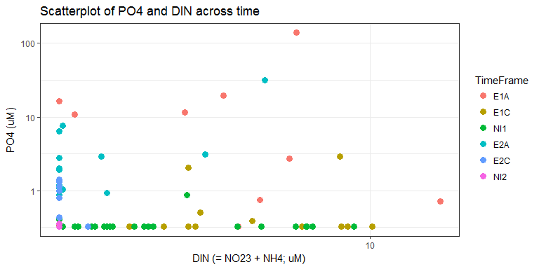
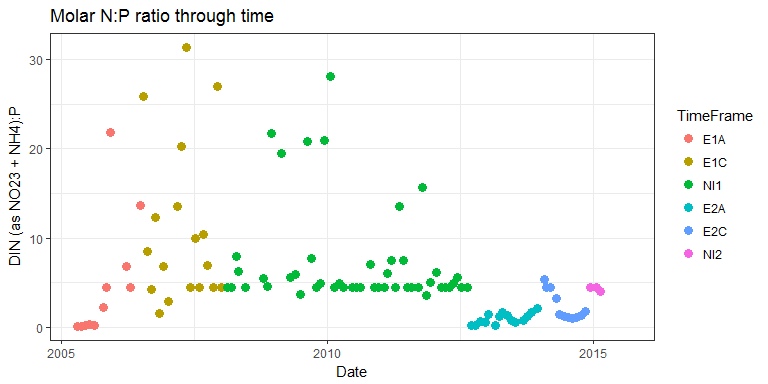
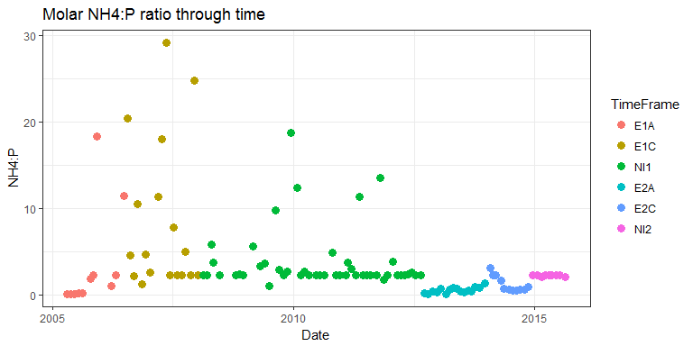

# N and P relationships - visual exploration
Kim Cressman  
`r Sys.Date()`  

```r
library(tidyverse)
library(lubridate)

setwd("C:/Users/kimberly.cressman/Desktop/Main Docs/Phosphate Publication/gndphosphate/Kim")
load("../data/nut_dat.RData")
```

### Data processing code chunk  
Expand this if you want to check either my reshaping of the dataset (I loaded `nut_dat.RData` from the gndphosphate GitHub repo) or my math going from mg/L to micromolar. The math I used was: 

+  PuM = Pmg/L * 1000 / 30.97  
+  NuM = Nmg/L * 1000 / 14  
+  DIN: NO23 + NH4, after converting both forms of N to micromolar


```r
BL <- nut_dat %>%
    filter(StationCode=="BL")

# make it wide; add in columns for molarity (MICROMOLAR is the unit) and ratios
BL <- BL %>%
    select(TimeFrame, date, nutrient, value) %>%
    spread(key=nutrient, value=value) %>%
    mutate(PO4M = PO4F * 1000/30.97, 
           NO23M = NO23F * 1000/14, 
           NH4M = NH4F * 1000/14,
           DINM = NH4M + NO23M,
           NtoP = DINM/PO4M,
           NH4toP = NH4M/PO4M)
```

******

### Scatterplot of DIN (as NO23 + NH4) and PO4, colored by time period 

+  These have been converted to micromolar.  
+  I ignored "below detection" data points and just allowed 0.01 to be used.


```r
# scatter plot of DIN and PO4, colored by time
ggplot(BL) +
    geom_point(aes(x=DINM, y=PO4M, col=TimeFrame), size=3) +
    scale_y_log10() +
    scale_x_log10() +
    theme_bw() +
    ggtitle("Scatterplot of PO4 and DIN across time") +
    xlab("DIN (= NO23 + NH4; uM)") +
    ylab("PO4 (uM)")
```

<!-- -->

******

### Time series of DIN (as NO23 + NH4) to PO4 ratio  

+  These were converted to micromolar.  
+  I again ignored "below detection" data points. 


```r
# time series, as points, of N:P molar ratio
ggplot(BL) +
    geom_point(aes(x=date, y=NtoP, col=TimeFrame), size=3) +
    theme_bw() +
    ggtitle("Molar N:P ratio through time") +
    xlab("Date") +
    ylab("DIN (as NO23 + NH4):P")
```

<!-- -->

******

### Time series of NH4:PO4 ratio 

+  Made this one because NO23 is almost always below detection, and NH4 almost always _isn't_.  
+  Again, converted to micromolar and ignoring "below detection" data points.  
+  This looks almost exactly like the DIN:P ratio graph, with a few exceptions in NI1.


```r
# and NH4:P
ggplot(BL) +
    geom_point(aes(x=date, y=NH4toP, col=TimeFrame), size=3) +
    theme_bw() +
    ggtitle("Molar NH4:P ratio through time") +
    xlab("Date") +
    ylab("NH4:P")
```

<!-- -->


******

__Housekeeping__  


```r
sessionInfo()
```

```
## R version 3.3.2 (2016-10-31)
## Platform: x86_64-w64-mingw32/x64 (64-bit)
## Running under: Windows 7 x64 (build 7601) Service Pack 1
## 
## locale:
## [1] LC_COLLATE=English_United States.1252 
## [2] LC_CTYPE=English_United States.1252   
## [3] LC_MONETARY=English_United States.1252
## [4] LC_NUMERIC=C                          
## [5] LC_TIME=English_United States.1252    
## 
## attached base packages:
## [1] stats     graphics  grDevices utils     datasets  methods   base     
## 
## other attached packages:
## [1] lubridate_1.6.0 dplyr_0.5.0     purrr_0.2.2.2   readr_1.1.1    
## [5] tidyr_0.6.3     tibble_1.2      ggplot2_2.2.1   tidyverse_1.1.1
## 
## loaded via a namespace (and not attached):
##  [1] Rcpp_0.12.7      formatR_1.4      plyr_1.8.4       forcats_0.2.0   
##  [5] tools_3.3.2      digest_0.6.10    jsonlite_1.2     evaluate_0.10   
##  [9] nlme_3.1-128     gtable_0.2.0     lattice_0.20-34  psych_1.7.5     
## [13] DBI_0.5-1        yaml_2.1.13      parallel_3.3.2   haven_1.0.0     
## [17] xml2_1.0.0       stringr_1.1.0    httr_1.2.1       knitr_1.14      
## [21] hms_0.3          rprojroot_1.2    grid_3.3.2       R6_2.2.0        
## [25] readxl_0.1.1     foreign_0.8-67   rmarkdown_1.5    modelr_0.1.0    
## [29] reshape2_1.4.2   magrittr_1.5     backports_1.0.5  scales_0.4.1    
## [33] htmltools_0.3.5  rvest_0.3.2      assertthat_0.1   mnormt_1.5-5    
## [37] colorspace_1.2-7 labeling_0.3     stringi_1.1.2    lazyeval_0.2.0  
## [41] munsell_0.4.3    broom_0.4.2
```

```r
Sys.info()
```

```
##                      sysname                      release 
##                    "Windows"                      "7 x64" 
##                      version                     nodename 
## "build 7601, Service Pack 1"                "LAPTOP-6508" 
##                      machine                        login 
##                     "x86-64"          "kimberly.cressman" 
##                         user               effective_user 
##          "kimberly.cressman"          "kimberly.cressman"
```

