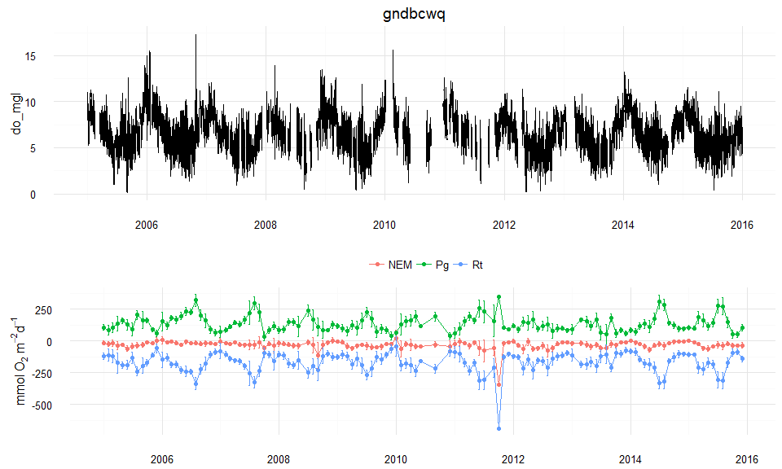
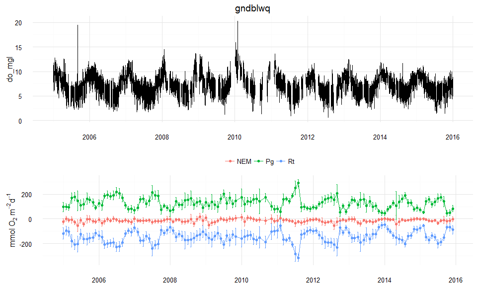
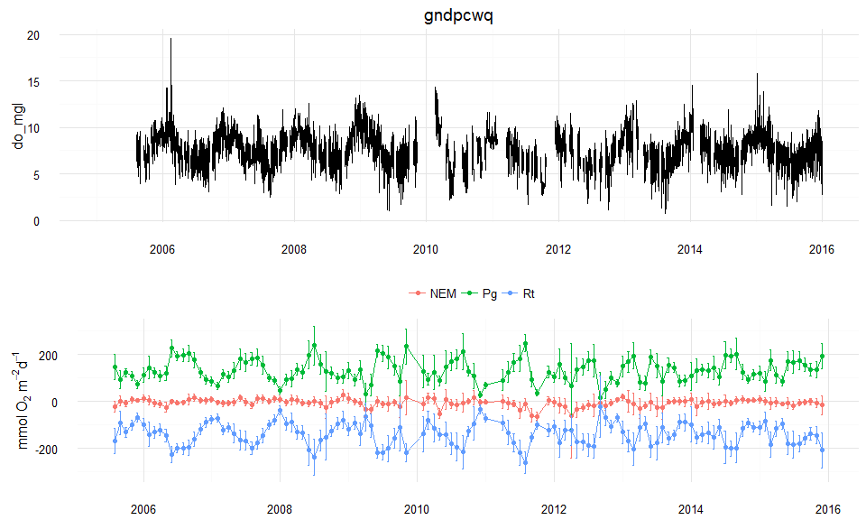

## Estimates of ecosystem metabolism for Grand Bay wq stations

The data were downloaded from CDMO, imported into R, and processed with SWMPr.  Water quality stations included Bayou Cumbest (bc), Bangs Lake (bl), and Point Aux Chenes (pc). Water quality data were combined with weather data from Crooked Bayou.


```r
library(SWMPr)
library(dplyr)

# process met for metab
met <- import_local('C:/Users/mbeck/Desktop/813213.zip', 'gndcrmet')
met_proc <- qaqc(met, qaqc_keep = c(0, 4)) %>% 
  subset(., select = c('atemp', 'bp', 'wspd'), subset = '2005-01-01 0:0', operator = '>=')

# wq stations to process
sta <- c('gndbcwq', 'gndblwq', 'gndpcwq')

# output list to append results
gnd_metab <- vector('list', length = length(sta))
names(gnd_metab) <- sta

# iterate through stations
for(st in sta){
  
  # import
  dat <- import_local('C:/Users/mbeck/Desktop/813213.zip', st, trace = TRUE)
  
  # qaqc, subset, combine with met, get ecometab
  dat_proc <- qaqc(dat, qaqc_keep = c(0, 4)) %>% 
    subset(., select = c('do_mgl', 'depth', 'temp', 'sal'), subset = '2005-01-01 0:0', operator = '>=') %>% 
    comb(., met_proc, timestep = 15) %>% 
    ecometab(., trace = TRUE)
  
  # append to output list
  gnd_metab[[st]] <- dat_proc
  
}

# save data file
save(gnd_metab, file = 'gnd_metab.RData')
```

Plots of DO and ecosystem metabolism by station:


```r
load(file = 'gnd_metab.RData')

for(i in 1:length(gnd_metab)){
  
  # station
  dat <- gnd_metab[[i]]
  
  # do plot
  p1 <- ggplot(dat, aes(x = datetimestamp, y = do_mgl)) +
    geom_line() + 
    theme_minimal() +
    theme(axis.title.x = element_blank()) + 
    ggtitle(names(gnd_metab)[i])
  
  # metab plot
  p2 <- plot_metab(dat) +
    theme_minimal() +
    theme(legend.position = 'top', legend.title = element_blank(), axis.title.x = element_blank())
  
  grid.arrange(p1, p2, ncol = 1)
   
}
```



Tabular summaries can be obtained with `aggremetab`.


```r
st <- 'gndbcwq'
summ <- aggremetab(gnd_metab[[st]], by = 'years')
knitr::kable(summ)
```


date         Estimate           val        lower        upper
-----------  ---------  -----------  -----------  -----------
2005-01-01   NEM          -26.16372    -20.21009    -32.11735
2006-01-01   NEM          -14.57644    -10.04787    -19.10500
2007-01-01   NEM          -23.93143    -17.14122    -30.72164
2008-01-01   NEM          -24.59738    -16.51222    -32.68254
2009-01-01   NEM          -34.15823    -28.96579    -39.35067
2010-01-01   NEM          -34.21961    -23.53343    -44.90578
2011-01-01   NEM          -24.43925    -16.55321    -32.32530
2012-01-01   NEM          -36.29182    -29.43948    -43.14417
2013-01-01   NEM          -30.46346    -24.89666    -36.03025
2014-01-01   NEM          -25.43430    -20.07210    -30.79650
2015-01-01   NEM          -32.78027    -27.49370    -38.06685
2005-01-01   Pg           126.04403    137.96846    114.11961
2006-01-01   Pg           179.78716    192.13308    167.44123
2007-01-01   Pg           139.20126    152.91801    125.48450
2008-01-01   Pg           132.13317    144.29814    119.96820
2009-01-01   Pg           112.35720    124.92602     99.78837
2010-01-01   Pg           156.73704    177.05963    136.41446
2011-01-01   Pg           134.57406    147.29708    121.85105
2012-01-01   Pg           111.59022    121.83120    101.34924
2013-01-01   Pg           109.81777    122.86616     96.76937
2014-01-01   Pg           144.91187    158.06774    131.75599
2015-01-01   Pg           137.76460    150.05995    125.46925
2005-01-01   Rt          -152.20775   -139.15620   -165.25931
2006-01-01   Rt          -194.36359   -182.50665   -206.22054
2007-01-01   Rt          -163.13269   -149.70343   -176.56195
2008-01-01   Rt          -156.73055   -144.20126   -169.25984
2009-01-01   Rt          -146.51543   -133.86465   -159.16621
2010-01-01   Rt          -190.95665   -170.95387   -210.95943
2011-01-01   Rt          -159.01332   -144.03903   -173.98761
2012-01-01   Rt          -147.88204   -136.61080   -159.15329
2013-01-01   Rt          -140.28122   -127.23433   -153.32811
2014-01-01   Rt          -170.34617   -157.17495   -183.51738
2015-01-01   Rt          -170.54488   -158.08765   -183.00211

